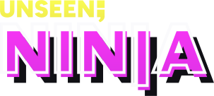
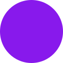
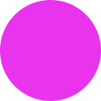
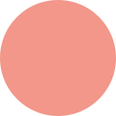
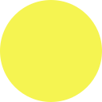
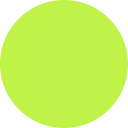
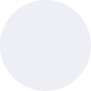

&nbsp;

<h3 align="center">
  
</h3>

&nbsp;

### 🎨 Palette

<table>

  <tr>
    <th></th>
    <th align="left">Name</th>
    <th align="left">Hex</th>
    <th align="left">LCH</th>
    <th align="left">CMYK</th>
  </tr>
  
  <tr>
    <th></th>
    <th colspan="4" align="left">Accents</th>
  </tr>
  
  <tr>
    <td></td>
    <td>Grape</td>
    <td><code>#8819EC</code></td>
    <td><code>lch(40.014% 108.495 309.59)</code></td>
    <td><code>42% 89% 0% 7%</code></td>
  </tr>
  
  <tr>
    <td></td>
    <td>Raspberry</td>
    <td><code>#EA33ED</code></td>
    <td><code>lch(57.859% 97.892 326.222)</code></td>
    <td><code>1% 78% 0% 7%</code></td>
  </tr>
  
  <tr>
    <td></td>
    <td>Peach</td>
    <td><code>#F2978A</code></td>
    <td><code>lch(71.881% 40.541 32.926)</code></td>
    <td><code>0% 38% 43% 5%</code></td>
  </tr>
  
  <tr>
    <td></td>
    <td>Lemon</td>
    <td><code>#F5F451</code></td>
    <td><code>lch(94.17% 75.545 100.177)</code></td>
    <td><code>0% 0% 67% 4%</code></td>
  </tr>
  
  <tr>
    <td></td>
    <td>Pear</td>
    <td><code>#BFF347</code></td>
    <td><code>lch(89.96% 79.92 115.45)</code></td>
    <td><code>21% 0% 71% 5%</code></td>
  </tr>
  
  <tr>
    <td></td>
    <td>Lychee</td>
    <td><code>#EEEEF5</code></td>
    <td><code>lch(94.314% 2.996 284.311)</code></td>
    <td><code>3% 3% 0% 4%</code></td>
  </tr>
  
  <tr>
    <td></td>
    <td>Blackberry</td>
    <td><code>#191923</code></td>
    <td><code>lch(9.116% 7.269 287.344)</code></td>
    <td><code>29% 29% 0% 86%</code></td>
  </tr>
  
  <tr>
    <th></th>
    <th colspan="4" align="left">Bases</th>
  </tr>
  
  <tr>
    <td></td>
    <td>White</td>
    <td><code>#FFFFFF</code></td>
    <td><code>lch(100% 0 0)</code></td>
    <td><code>0% 0% 0% 0%</code></td>
  </tr>
  
  <tr>
    <td></td>
    <td>Black</td>
    <td><code>#101015</code></td>
    <td><code>lch(4.807% 3.011 285.248)</code></td>
    <td><code>24% 24% 0% 92%</code></td>
  </tr>
  
</table>

Accent colours can be modified by subtracting or subtracting the following parameters:
```
lightness: `4`
chroma: `2`
hue: `1`
```

&nbsp;

### 📜 License

This is released under the MIT license, which grants the following permissions:

- Commercial use
- Distribution
- Modification
- Private use

For more convoluted language, see the [license file](license).

&nbsp;

<p align="center">
  <a href="https://unseen.ninja">
    
  </a>
</p>
